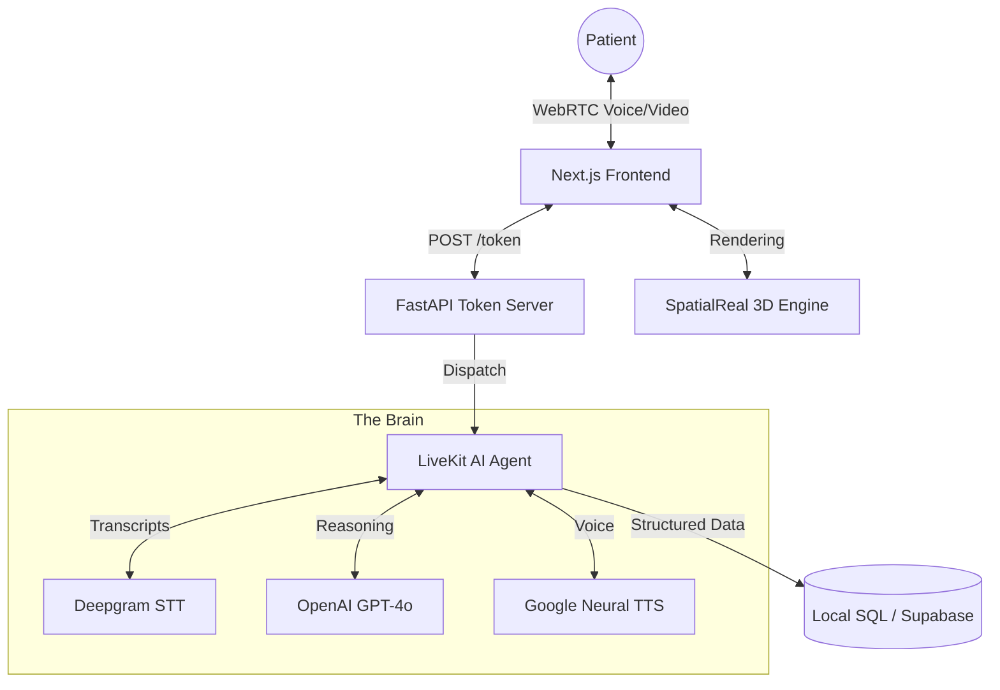

<div align="center">
  
  <p><strong>Aarohi: Virtual AI Nurse Assistant</strong></p>
  <p>An interactive technical asset engineered to showcase low-latency voice orchestration, 3D avatar synchronization, and complex clinical agentic workflows.</p>
  <p>
    <a href="https://nextjs.org/" target="_blank" rel="noreferrer">
      
    </a>
    <a href="https://openai.com/" target="_blank" rel="noreferrer">
      
    </a>
    <a href="https://livekit.io/" target="_blank" rel="noreferrer">
      
    </a>
    <a href="https://deepgram.com/" target="_blank" rel="noreferrer">
      
    </a>
    <a href="https://spatialreal.ai/" target="_blank" rel="noreferrer">
      
    </a>
    <a href="https://www.python.org/" target="_blank" rel="noreferrer">
      
    </a>
  </p>
</div>

## Overview
**Aarohi** is a high-fidelity virtual healthcare assistant designed to automate and humanize the patient intake process. By combining real-time 3D avatar rendering with OpenAI's multimodal intelligence, Aarohi engages patients in natural conversation to collect clinical details, perform basic triage, and securely store data for medical review.

---

## System Architecture



---

<!-- ## Visual Technology: SpatialReal
Aarohi features a professional nurse persona powered by [SpatialReal](https://spatialreal.ai/). Unlike traditional cloud-based video bots, SpatialReal uses on-device 3D rendering via WebAssembly (WASM) to provide a high-fidelity, empathetic presence with industry-leading performance.

| Feature | SpatialReal (On-Device) | Cloud Video Avatars |
| :--- | :--- | :--- |
| **Latency** | <300ms | 300–2000ms |
| **Cost** | 1/100 compute cost | High cloud usage |
| **Quality** | Natural & controllable | Stiff or uncanny output |
| **Bandwidth** | 10–20KB/s | ≥2 Mbps streaming |
| **Integration** | Simple SDK | Complex backend | -->

# SpatialReal
SpatialReal is the next-generation AI infrastructure for empathetic human-AI interactions. We build **real-time**, **high-fidelity**, and **cost-effective** digital avatar interactions through on-device rendering technology.

<Frame>
  
</Frame>

<p style={{ fontSize: '0.875rem', opacity: 0.75, marginTop: 8 }}>
  In the pipeline diagram: ASR = Automatic Speech Recognition, LLM = Large Language Model, TTS = Text-to-Speech, S2S = Speech-to-Speech (e.g. Gemini Live).
</p>

## Why SpatialReal?

Traditional digital avatar solutions force painful trade-offs between cost, visual quality, and real-time performance. SpatialReal solves this trilemma:

| Metric            | Traditional Cloud Rendering  | SpatialReal On-Device          |
| ----------------- | ---------------------------- | ------------------------------ |
| **Bandwidth**     | 1-2 MB/s (Video Stream)      | 10-20 KB/s (Driver Data)       |
| **Cost**          | High GPU rental costs        | Ultra-low edge compute         |
| **Latency**       | > 3s                         | \< 1.5s                        |
| **Compatibility** | High-speed network dependent | 99% of Android/iOS/Web devices |

## Use Cases

* **Online Education** - Immersive 1-on-1 tutoring with precise lip-sync for language learning and K12
* **Recruitment & Training** - 7x24h AI interviewers and roleplay training simulations
* **Customer Service** - Brand ambassadors with visual eye contact that builds emotional connection

## Creating an account

### Sign Up

Visit [SpatialReal Studio](https://app.spatialreal.ai/) to create your free account.

### SpatialReal Studio

[SpatialReal Studio](https://app.spatialreal.ai/) is your control center where you can:

* Free access to a large avatar library
* Manage your API keys
* Monitor your usage
* Control your subscription

---

## Deployment & Quick Setup

### Option A: Docker (Recommended for Production)
Aarohi is fully containerized. You can spin up the entire stack (Frontend, FastAPI Token Server, and LiveKit Agent Worker) using Docker Compose.

1. Create a `.env` file in the root directory (or update `backend/.env` and `frontend/.env`):
   ```env
   # Backend
   OPENAI_API_KEY=your_key
   DEEPGRAM_API_KEY=your_key
   LIVEKIT_URL=your_url
   LIVEKIT_API_KEY=your_key
   LIVEKIT_API_SECRET=your_secret
   ENCRYPTION_SECRET_KEY=your_encryption_key
   CLOUD_DB_URL=postgresql://... # Optional

   # Frontend
   NEXT_PUBLIC_SPATIALREAL_APP_ID=your_app_id
   NEXT_PUBLIC_SPATIALREAL_AVATAR_ID=your_avatar_id
   ```
2. Build and start the cluster:
   ```bash
   docker-compose up --build -d
   ```
3. Visit `http://localhost:3000`

### Option B: Manual Local Development

#### 1. Backend (Python 3.12+)
```bash
cd backend
uv sync
uv run python main.py dev
uv run uvicorn token_server:app --port 8080
```

#### 2. Frontend (Next.js)
```bash
cd frontend
pnpm install
pnpm dev
```

---


## Advanced Architectural Features
- **Cloud-First Database with Local Fallback:** Uses `SQLModel` to attempt saving data to a cloud PostgreSQL database first. If the cloud is down, it safely falls back to a local SQLite database and automatically syncs the records in the background when the cloud recovers.
- **Application-Level PII Encryption:** Sensitive patient data (Protected Health Information) is symmetrically encrypted in memory using `cryptography` before being saved to the database, ensuring zero-knowledge at rest.
- **Strict Data Validation:** Utilizes strict Pydantic schemas within the AI Agent to force the LLM to output cleanly typed integers and enums, avoiding fragile string-parsing hacks.
- **Robust State Management:** The Next.js frontend uses `zustand` for reliable, cross-navigation global state management.

## What Aarohi Does
- **Structured Intake:** Collects Name, Symptoms, Pain Severity, and Medical History.
- **Autonomous DB Submission:** Automatically saves patient reports to database once the conversation is completed.
- **State-Driven UI:** Automatically redirects users to a success page after data validation.
- **Real-Time Knowledge:** Provides current date/time and location-aware information using tools.

---

<div align="center">
  <p><strong>Aarogyam AI – Pioneering the Future of Digital Healthcare</strong></p>
</div>
