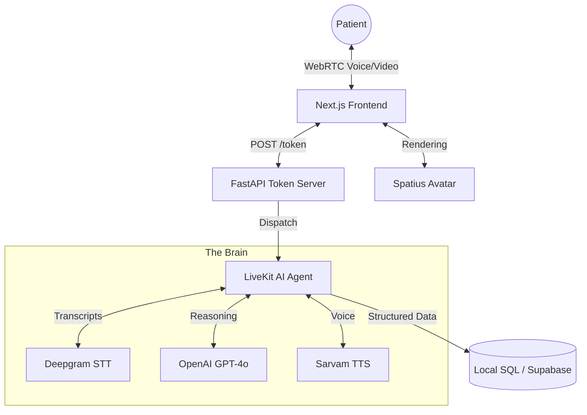

<div align="center">
  
  <p><strong>Aarohi: Virtual AI Nurse Assistant</strong></p>
  <p>An interactive technical asset engineered to showcase low-latency voice orchestration, 3D avatar synchronization, and complex clinical agentic workflows.</p>
  <p>
    <a href="https://nextjs.org/" target="_blank" rel="noreferrer">
      
    </a>
    <a href="https://openai.com/" target="_blank" rel="noreferrer">
      
    </a>
    <a href="https://livekit.io/" target="_blank" rel="noreferrer">
      
    </a>
    <a href="https://deepgram.com/" target="_blank" rel="noreferrer">
      
    </a>
    <a href="https://spatius.ai/" target="_blank" rel="noreferrer">
      
    </a>
    <a href="https://www.python.org/" target="_blank" rel="noreferrer">
      
    </a>
  </p>
</div>

## Overview
**Aarohi** is a high-fidelity virtual healthcare assistant designed to automate and humanize the patient intake process. By combining real-time 3D avatar rendering with OpenAI's intelligence, Aarohi engages patients in natural conversation to collect clinical details, perform basic triage, and securely store data for medical review.

---

## System Architecture



---

## Spatius — Real-Time Avatar Rendering

Spatius powers Aarohi's 3D avatar. It turns avatar speech audio into real-time motion data. Your client renders the avatar locally, so you do not need to stream finished avatar video.

> Full documentation: https://docs.spatius.ai/llms.txt

### Core Components

| Term | What it is |
| --- | --- |
| **Spatius** | The platform — [Spatius Studio](https://app.spatius.ai) for managing apps and avatars, Motion Server in the cloud, and the AvatarKit SDKs you ship in your app. |
| **AvatarKit** | The client SDK family that downloads avatar assets, renders the avatar locally, and plays synchronized audio. Available for Web, iOS, Android, and Flutter. |
| **Motion Server** | The Spatius cloud service that receives avatar speech audio and returns lip-sync motion data, ~10–15 KB/s. |

### Integration Paths

| Path | Description |
| --- | --- |
| [LiveKit Agents Integration](https://docs.spatius.ai/livekit-agents/overview) | Add `livekit-plugins-spatius` to your LiveKit Agents worker. Web client today. |
| [Direct Mode](https://docs.spatius.ai/direct-mode/overview) | Your client connects to Motion Server directly. Smallest footprint; your backend only mints Session Tokens. |
| [Backend Mode](https://docs.spatius.ai/backend-mode/overview) | Your backend owns ASR, LLM, TTS, the Server SDK, and the downstream transport. |

### Quick Links

- [Get credentials](https://docs.spatius.ai/getting-started/credentials) — App ID, Avatar ID, Session Token, API Key
- [Choose your integration path](https://docs.spatius.ai/getting-started/how-to-integrate) — Compare latency, client support, and effort
- [Run a quickstart](https://docs.spatius.ai/quickstarts/overview) — Web, iOS, Android, and Flutter first-run guides

---

## Deployment & Quick Setup

### Option A: Docker (Recommended for Production)
Aarohi is fully containerized. You can spin up the entire stack (Frontend, FastAPI Token Server, and LiveKit Agent Worker) using Docker Compose.

1. Create a `.env` file in the root directory (or update `backend/.env` and `frontend/.env`):
   ```env
   # Backend
   OPENAI_API_KEY=your_key
   DEEPGRAM_API_KEY=your_key
   LIVEKIT_URL=your_url
   LIVEKIT_API_KEY=your_key
   LIVEKIT_API_SECRET=your_secret
   ENCRYPTION_SECRET_KEY=your_encryption_key
    DATABASE_URL=postgresql://... # Optional cloud DB

    # Frontend
    NEXT_PUBLIC_SPATIUS_APP_ID=your_app_id
    NEXT_PUBLIC_SPATIUS_AVATAR_ID=your_avatar_id
   ```
2. Build and start the cluster:
   ```bash
   docker-compose up --build -d
   ```
3. Visit `http://localhost:3000`

### Option B: Manual Local Development

#### 1. Backend (Python 3.12+)
```bash
cd backend
uv sync
uv run python main.py dev
uv run uvicorn token_server:app --port 8080
```

#### 2. Frontend (Next.js)
```bash
cd frontend
pnpm install
pnpm dev
```

---


## Advanced Architectural Features
- **Cloud-First Database with Local Fallback:** Uses `SQLModel` to attempt saving data to a cloud PostgreSQL database first. If the cloud is down, it safely falls back to a local SQLite database and automatically syncs the records in the background when the cloud recovers.
- **Application-Level PII Encryption:** Sensitive patient data (Protected Health Information) is symmetrically encrypted in memory using `cryptography` before being saved to the database, ensuring zero-knowledge at rest.
- **Strict Data Validation:** Utilizes strict Pydantic schemas within the AI Agent to force the LLM to output cleanly typed integers and enums, avoiding fragile string-parsing hacks.

## What Aarohi Does
- **Structured Intake:** Collects Name, Symptoms, Pain Severity, and Medical History.
- **Autonomous DB Submission:** Automatically saves patient reports to database once the conversation is completed.
- **State-Driven UI:** Automatically redirects users to a success page after data validation.
- **Real-Time Knowledge:** Provides current date/time and location-aware information using tools.

---

<div align="center">
  <p><strong>Aarogyam AI – Pioneering the Future of Digital Healthcare</strong></p>
</div>
